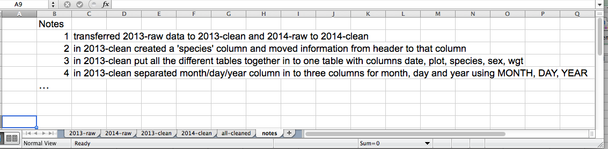

Authors: **Katja Seltmann**,**Christie Bahlai**, **Aleksandra Pawlik** 
Contributors: **Jennifer Bryan**, **Alexander Duryee**, **Jeffrey Hollister**, **Daisie Huang**, **Owen Jones**, 
**Ben Marwick** and **Sebastian Kupny**.

## Learning Objectives
* Learning best practices for recording and formatting data in spreadsheets
* Understanding the correspondence between columns and rows in spreadsheets 
and data structure
* Understanding the correspondence between spreadsheet cells, columns and rows 
and data observations and values

The most common mistake made is treating the 
program like it is a lab notebook- that is, relying on context, notes in the 
margin, spatial layout of data and fields to convey information. As humans, 
we can (usually) interpret these things, but computers are dumb, and unless 
we explain to the computer what every single thing means, it will not be able 
to see how our data fit together.

Using the power of computers, we can manage and analyze data in much more 
effective and faster ways, but to use that power, we have to set up
our data for the computer to be able to understand it (and computers are very 
literal).

This is why it’s extremely important to set up well-formatted tables from the 
outset- before you even start entering data from your very first preliminary 
experiment. **Data organization is the foundation of your research project.**
It can make it easier or harder to work with your data throughout your
analysis, so it's worth thinking about when you're doing your data
entry or setting up your experiment. You can set things up in a different
way in spreadsheets, but it limits your ability to work with the data
in other programs or have the you-of-6-months-from-now or your collaborator
work with the data. 

### Keeping track of your analyses

When you're working with spreadsheets, during data clean up or analyses, it's
very easy to end up with a spreadsheet that looks very different from the one
you started with. In order to be able to reproduce your analyses or figure out
what you did when Reviewer #3 asks for a different analysis, **you must**

- **create a new file or tab with your cleaned or analyzed data.** Do not modify
that original dataset, or you will never know where you started!
- **keep track of the steps you took in your clean up or analysis.** You should track 
these steps as you would any step in an experiment. You can
do this in another text file, or a good option is to create a new tab in your spreadsheet
with your notes. This way the notes and data stay together.

This might be an example of a spreadsheet setup:

Put these principles in to practice today during your Exercises. 

### Structuring data in spreadsheets

The cardinal rules of using spreadsheet programs for data:

1. Put all your variables in columns - the thing you're measuring. Highly suggested to follow Darwin Core right away, as it will reduce your questions later. For values that do not fit nicely in Darwin Core, keep a document that defines your fields clearly.
2. Put each observation in its own row.
3. Don't combine multiple pieces of information in one cell. Sometimes it just 
seems like one thing, but think if that's the only way you'll want to be able to use or sort that data. 
4. Leave the raw data raw - don’t mess with it!
5. Export the cleaned data to a text based format like CSV. This ensures that anyone 
can use the data, and is the format required by most data repositories.

## Exercise

We're going to take a messy subset of the occurrence data spreadsheet and clean it up.

- Download the data by clicking [here](https://goo.gl/gyRwx7)

###Importing Your Data
1. Look in Text Editor
1. Make a backup
2. Import into Excel as text (other import data types)?
3. Create a methods tab

###Let's Get Started
1. Merge the two tables together
2. Map Darwin Core and label headers
7. 0 and NULL values

##Generate a UUID or what kind of ID is that?
=LOWER(CONCATENATE(DEC2HEX(RANDBETWEEN(0,4294967295),8),"-",DEC2HEX(RANDBETWEEN(0,65535),4),"-",DEC2HEX(RANDBETWEEN(16384,20479),4),"-",DEC2HEX(RANDBETWEEN(32768,49151),4),"-",DEC2HEX(RANDBETWEEN(0,65535),4),DEC2HEX(RANDBETWEEN(0,4294967295),8)))

###Using Your Text Editor
4. Separate country and state [\s\w+\n]
5. =CONCATENATE() a scientificName
6. =TRIM() a field
7. Multiple data types in one field M/F

###Advanced Functions
7. Look at taxon names
8. Match =INDEX(Sheet3!$E$2:$E$35,MATCH(Sheet3!$B$2:$B$35,0))
9. =IFERROR()
9. Dates as Data

Previous: [Introduction](00-intro.html)
Next: [Exporting data.](05-exporting-data.html)
